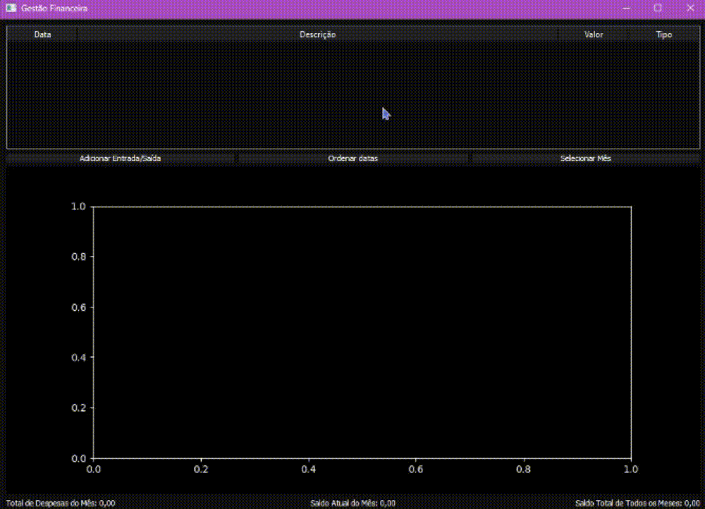
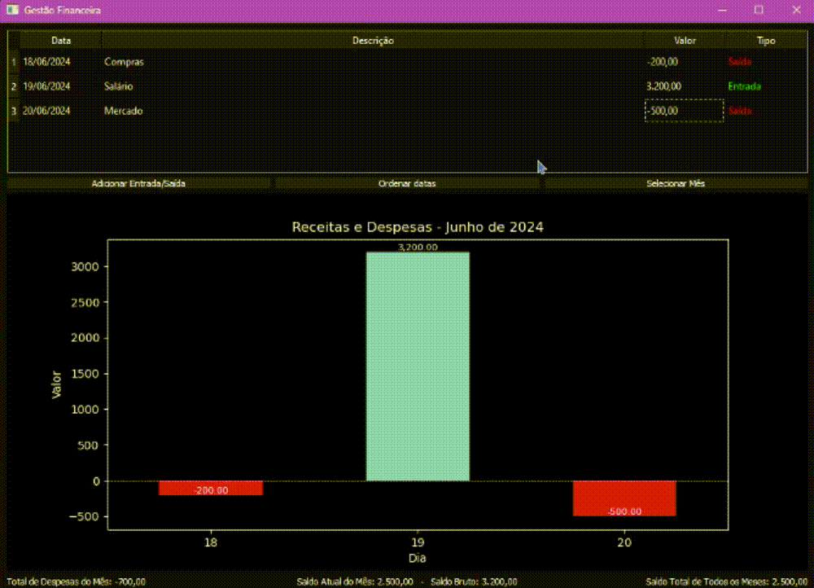

# Financial Management System

This project is a Python-based financial management system that allows users to track their income and expenses over time. It provides functionalities to add and remove financial entries, categorize them as income or expenses, and visualize the data through graphical representations. The system separates entries by year and month, ensuring organized and clear tracking of financial records.

## Features

- **Add and Remove Entries**: Users can add income and expense entries with descriptions and amounts. Press the del key to delete an entry.
- **Categorization**: Entries are categorized as income or expenses.
- **Monthly and Yearly Views**: Entries are automatically organized by year and month.
- **Graphical Representation**: A bar chart displays the monthly income and expenses.
- **Financial Summary:** Displays financial summaries, including total expenses, current month's balance, gross balance, and the total balance for all months.
- **User Interface**: Intuitive UI for easy interaction.

<div align='left'>
    
</div>
*Adding a new entry.*

<br/>
<br/>
<br/>
<div align='left'>
    
</div>
*Delete a entry.*


## Limitations

This open-source version does not include persistent data storage using a database. All data is lost when the program is closed.

## How to Run

1. **Clone the repository**:
    ```sh
    git clone https://github.com/AlexsanderMe/financial-management.git
    ```
2. **Navigate to the project directory**:
    ```sh
    cd financial-management
    ```
3. **Run the application**:
    ```sh
    python main.py
    ```

---

This project aims to provide an easy-to-use financial management tool for individuals and small businesses. I appreciate any feedback or suggestions for improvement.
